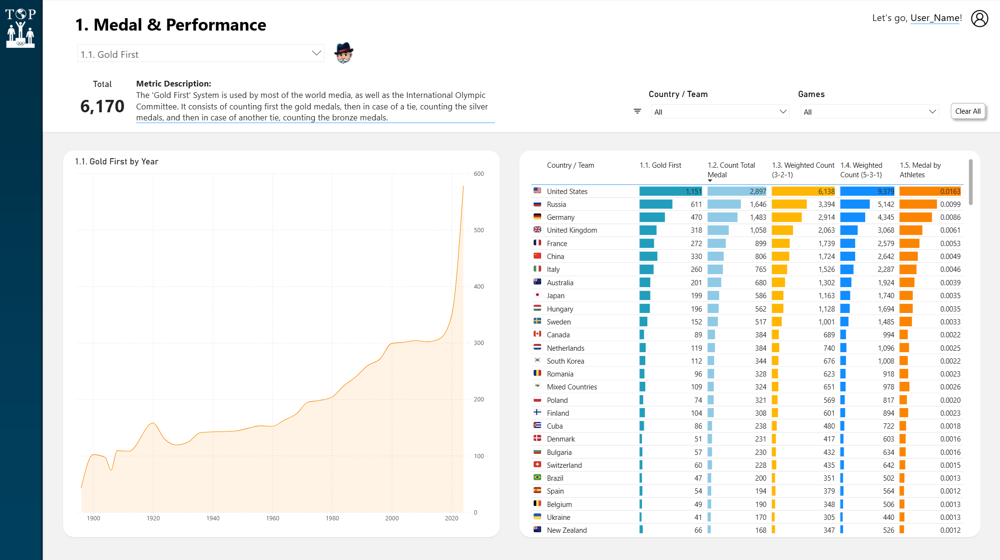
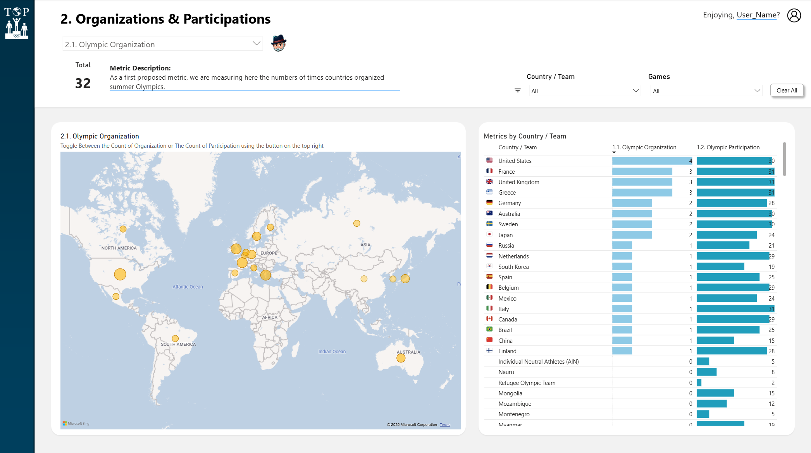
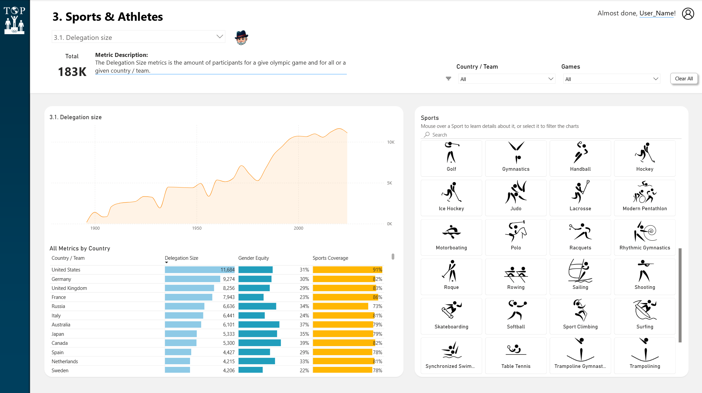
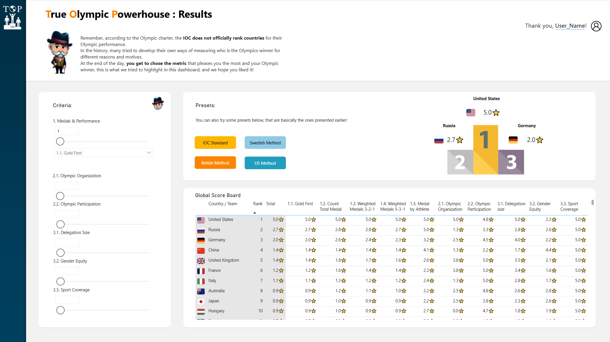

# 🏅 True Olympic Powerhouse (TOP) — Power BI Dashboard

> *"The Olympic Games are competitions between athletes in individual or team events and not between countries."*  
> — Pierre de Coubertin, Olympic Charter, Chapter 1, Section 6

**So — who is actually winning the Olympics?**

This dashboard was built for a **company-wide data visualization competition at Sanofi**, open to all analytics teams globally. It finished **Top 5 out of 80 competing teams**.

---

## The Problem

The IOC does not officially rank countries at the Olympic Games. Yet every broadcaster, every newspaper, and every national committee publishes its own medal table — each using a different counting method, for different reasons.

This raises a set of genuinely interesting questions:
- Why do medal tables differ so much across countries and media?
- Is "Gold First" really the fairest way to rank performance?
- Should we account for delegation size, sports coverage, or gender equity?
- And if we rethink the metric entirely — **who is the True Olympic Powerhouse?**

This dashboard makes those questions explorable, transparent, and answerable by the user.

---

## Dashboard Structure

The report is organized as a guided narrative across 4 analytical sections, each addressable through an interactive metric selector.

### Page 0 — Introduction
Sets the analytical framing: the IOC charter, the paradox of unofficial medal tables, and the central question the dashboard answers. Designed to earn the reader's curiosity before showing a single chart.

### Page 1 — Medal & Performance

Compares **5 distinct medal counting methodologies** side by side:

| Metric | Description |
|--------|-------------|
| **1.1 Gold First** | Standard IOC/media method — gold > silver > bronze |
| **1.2 Count Total Medal** | Raw total medal count, regardless of color |
| **1.3 Weighted Count (3-2-1)** | Gold = 3pts, Silver = 2pts, Bronze = 1pt |
| **1.4 Weighted Count (5-3-1)** | Higher weight differential for gold |
| **1.5 Medal by Athletes** | Medals normalized by delegation size |

Each metric includes a time-series evolution from Athens 1896 to the present, and a full country ranking table with in-row sparkbars for visual comparison across all 5 methods simultaneously.

### Page 2 — Organizations & Participations

Explores the **host nation dimension** and participation history across all Summer Games editions:

| Metric | Description |
|--------|-------------|
| **2.1 Olympic Organization** | Number of times a country has hosted the Summer Games |
| **2.2 Olympic Participation** | Number of Olympic editions a country has participated in |

Visualizations include a world map of host cities with bubble sizing, and a combined ranking table showing organization count vs. participation breadth side by side for all NOCs.

### Page 3 — Sports & Athletes

Examines **what countries actually compete in**, not just how many medals they win:

| Metric | Description |
|--------|-------------|
| **3.1 Delegation Size** | Total number of athletes sent per country per edition |
| **3.2 Gender Equity** | Share of female athletes in a country's delegation |
| **3.3 Sports Coverage** | Share of Olympic disciplines a country competes in |

Includes an interactive sport icon grid — clicking any sport filters all charts to that discipline. All metrics are available in a combined country ranking table.

### Page 4 — True Olympic Powerhouse: Results

The culminating page. Users **set their own weights** across all 8 metrics from the previous sections and generate a **personalized global scoreboard**:

| Criteria | Metrics included |
|----------|-----------------|
| **Medals & Performance** | 1.1 Gold First · 1.2 Total Medal · 1.3 Weighted (3-2-1) · 1.4 Weighted (5-3-1) · 1.5 Medal by Athletes |
| **Organizations & Participations** | 2.1 Olympic Organization · 2.2 Olympic Participation |
| **Sports & Athletes** | 3.1 Delegation Size · 3.2 Gender Equity · 3.3 Sports Coverage |

Preset configurations are provided for reference:

| Preset | Weighting philosophy |
|--------|---------------------|
| 🔵 **IOC Standard** | Gold First only |
| 🟡 **Swedish Method** | Total medal count |
| 🟠 **British Method** | Weighted medals with participation |
| 🟢 **US Method** | Gold-heavy weighted count |

The podium updates live based on user-selected criteria — making the answer to "who wins the Olympics" genuinely dependent on what you value.

---

## Data Model

The report uses a **star schema** built on the [Kaggle — 120 Years of Olympic History](https://www.kaggle.com/datasets/heesoo37/120-years-of-olympic-history-athletes-and-results) dataset, enriched and reshaped in Power Query.

**Fact tables:**
- `Sports Events & Medals` — core grain: one row per athlete per event per edition
- `Athletes & Events` — athlete-level detail linked to events

**Dimension tables:**
- `Athletes` — athlete profiles (name, age, sex, country, sport)
- `Games` — edition-level data (year, city, season, host country)
- `Countries` — NOC mapping with SVG flag references
- `Sports & Year` — sport × edition bridge
- `Calendar` — year dimension for time intelligence

**Parameter tables** (for metric switching via field parameters):
- `Medals & Performance Parameter`
- `Sports & Athletes Parameter`
- `Organizations & Participations Parameter`
- `Medal Metrics Picking`

**Measures Table** — 40+ DAX measures covering normalized counts, weighted scores, ranking logic, user-greeting dynamics, and toggle-driven metric switching.

---

## Key Technical Choices

**Field parameters for metric switching** — rather than duplicating pages or using bookmarks, all metric variants (Gold First, Weighted, Normalized, etc.) are driven by a single field parameter selection. This keeps the report lean and the UX seamless.

**SVG flags** — country flags are rendered inline using SVG URLs stored in the `Countries` table, providing crisp visuals at any resolution without image file dependencies.

**Personalized greetings** — the report reads the logged-in user's display name via `USERPRINCIPALNAME()` and displays a personalized greeting that evolves across pages ("Welcome, User_Name!" → "Let's go, User_Name!" → "Almost done, User_Name!" → "Thank you, User_Name!"). A small detail that was consistently noted by competition judges.

**Normalization logic** — the "Medal by Athletes" metric normalizes medal counts against delegation size per edition, not globally, to account for the dramatic growth of Olympic participation over 120 years. Raw normalization against a fixed denominator would severely distort early-era results.

**Ranking stability** — the composite score on the Results page uses rank-based scoring (1–5 stars per metric) rather than raw values, ensuring that metrics with very different scales (e.g., total medals vs. number of organizations) contribute proportionally to the final ranking.

---

## Data Source

**Kaggle — 120 Years of Olympic History: Athletes and Results**  
[https://www.kaggle.com/datasets/heesoo37/120-years-of-olympic-history-athletes-and-results](https://www.kaggle.com/datasets/heesoo37/120-years-of-olympic-history-athletes-and-results)

Coverage: Summer Olympic Games, Athens 1896 — Tokyo 2020.  
Enriched with host country data and SVG flag references for NOC mapping.

---

## Files

| File | Description |
|------|-------------|
| `True_Olympic_Powerhouse_-_V1.pbix` | Full Power BI report file |
| `screenshots/` | Dashboard page screenshots |

---

*Built for the Sanofi global analytics competition — because the answer to "who wins the Olympics" should be yours to decide.*
